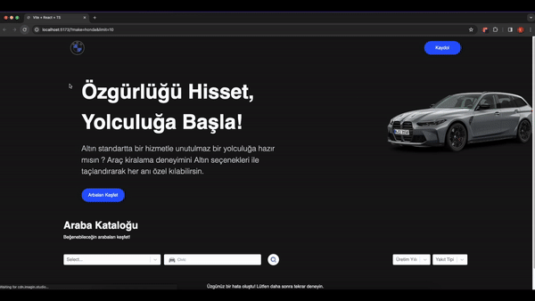

# Car Search Application

This project is a car search application that retrieves car data from RapidAPI, allowing users to filter and view the data. Below are the main libraries used and key features of the project.

## Libraries Used

- [React Router DOM](https://reactrouter.com/web/guides/quick-start): Used for page navigation and managing deep links.
- [React Select](https://react-select.com/): Utilized to provide user-friendly filtering options.
- [Framer Motion](https://www.framer.com/motion/): Employed for animations and transition effects.
- [Tailwind CSS](https://tailwindcss.com/): Used to create a fast and customizable user interface.

## How to Run the Project

1. Clone the project:

   ```bash
   git clone https://github.com/username/car-rental-app.git
   cd car-search-application
   ```

2. Install the required dependencies:

   ```bash
   npm install
   ```

3. **Update RapidAPI Keys:**

   - Open the `.env` file and replace the placeholders with your RapidAPI key and host:

     ```dotenv
     VITE_APP_KEY=your_rapidapi_key
     VITE_APP_HOST=your_rapidapi_host
     ```

   - Replace `your_rapidapi_key` and `your_rapidapi_host` with the API key and host information from your RapidAPI account.

4. Start the project:

   ```bash
   npm start
   ```

5. Open your browser and go to [http://localhost:3000](http://localhost:3000) to view the application.

## Features

- Fetching car data from RapidAPI.
- Page navigation using React Router DOM.
- User-friendly filtering options with React Select.
- Animations and transition effects using Framer Motion.

## Screen


